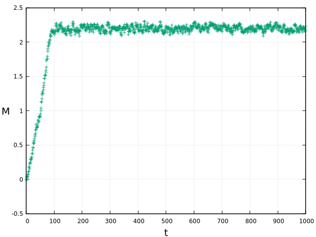
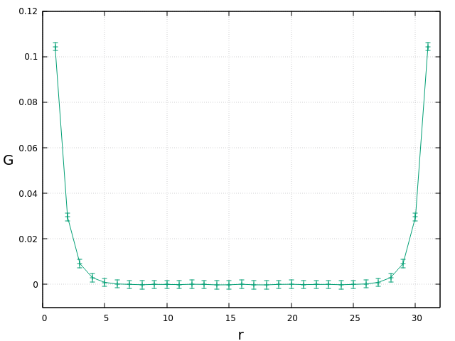
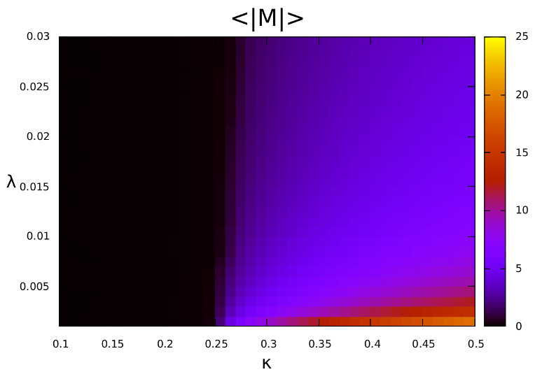

# Lattice Scalar Field Theory Simulation

A minimal python example of a lattice simulation for real, scalar phi-fourth theory on a d-dimensional periodic cubic lattice with the dimensionless formulation of the action. Details about the theory can be found e.g. in [arxiv:1705.06231](https://arxiv.org/abs/1705.06231) and [arxiv:1811.03533](https://arxiv.org/abs/1811.03533). Currently implemented algorithms are a random-site local Metropolis update, Hybrid/Hamiltonian Monte Carlo as well as a first-order Langevin evolution.

`main.py` contains a basic burn-in loop for performing 1000 HMC updates with a choice of action parameters in the broken phase, on a 2-dim. 32x32 lattice. The value of the field magnetization at every point in the Markov chain is stored in a text file. Plotting this file, one can observe equilibration to a non-zero expectation value:

Note that equilibration can take longer in some cases and should be carefully monitored. This is especially true for the local Metropolis update which requires several orders of magnitude more steps.

Following the burn-in phase, the simulation is run for an additional 10000 steps and every 10th configuration is recorded. Some observables are calculated with the resulting dataset, errors are obtained using the statistical jackknife method. The two-point correlation function takes the following shape:

The theory belongs to the Ising universality class. As such, in d>1 one observes a phase transition associated with spontaneous breaking of Z2 symmetry. Calculating expectation values of the magnetization for a regular grid of couplings, we can visualize the phase boundary:

